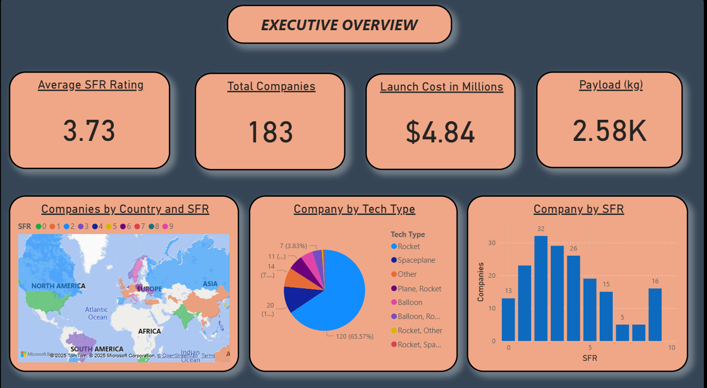
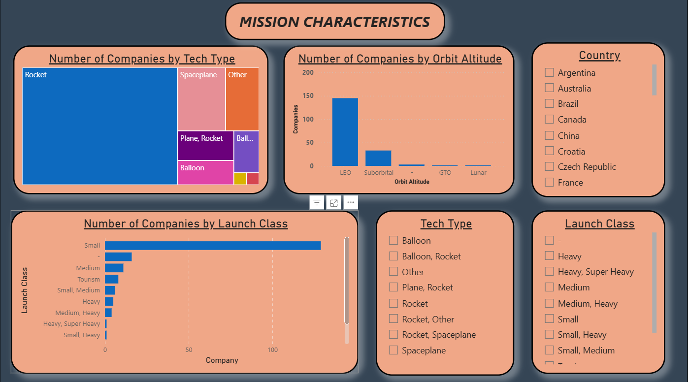
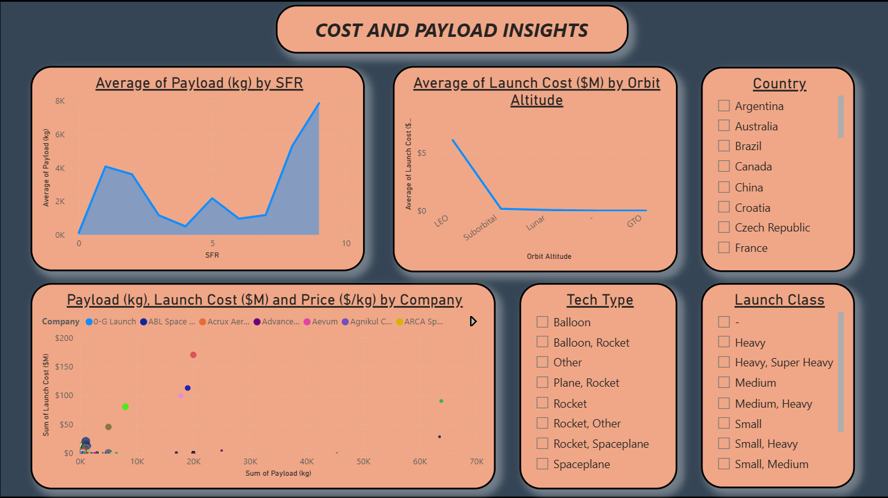
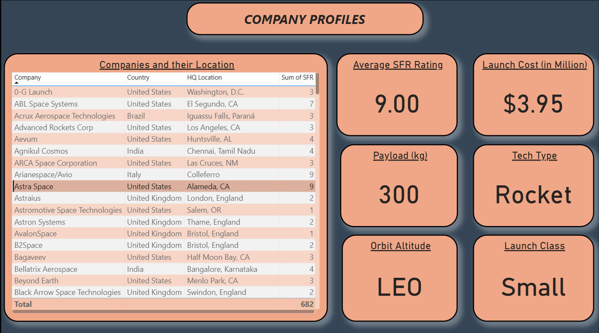

# 🚀 Space Fund Realty (SFR) Analysis

## 🧠 Introduction
The **Space Fund Realty (SFR) Analysis** project focuses on evaluating aerospace companies and their missions to provide **actionable insights for investors and stakeholders**. The main objective is to analyze the **SFR rating** — a metric from **1 to 9** that reflects a company’s development, stability, and capability to execute space missions.

Higher SFR scores represent well-established companies capable of managing **larger payloads and high-cost missions**, while lower scores reflect **early-stage or emerging companies**. By studying mission attributes such as **payload**, **launch cost**, **launch class**, **orbit altitude**, and **technology type**, this analysis reveals patterns that can help understand the maturity and investment potential of aerospace firms worldwide.

📝 The complete analysis, visualizations, and model results are documented in the Jupyter Notebook: **`SFR_analysis.ipynb`**.

---

## ⚙️ Methodology

### 1️⃣ Data Exploration and Cleaning
- Imported and inspected the SFR dataset containing mission and company attributes.
- Handled missing or inconsistent values across key features (payload, cost, orbit altitude).
- Standardized categorical variables such as **launch class**, **tech type**, and **region** for analysis.

### 2️⃣ Exploratory Data Analysis (EDA)
- Investigated the **distribution of SFR scores** across countries and companies.
- Analyzed the **relationship between mission characteristics** and SFR.
- Visualized **payload**, **launch cost**, and **orbit altitude** distributions to identify trends.
- Generated correlation heatmaps and comparative bar charts to detect significant patterns.

### 3️⃣ Machine Learning Modeling
- Framed the prediction problem as a **classification task** to estimate SFR category levels.
- Implemented:
  - **Decision Tree Classifier**
  - **Random Forest Classifier**
- Evaluated models using **accuracy, recall, and confusion matrix**.
- Extracted **feature importances** to identify mission characteristics influencing SFR.

---

## 📈 Results & Insights

### 🌍 Geographical Distribution
- The **United States** hosts the majority of aerospace companies with high SFR ratings.  
- **China**, though having fewer companies, ranks **second** for SFR > 6, reflecting a smaller but highly developed segment.

### 🚀 Mission Characteristics
- Most missions are **rocket-type** and **small launch class**, targeting **Low Earth Orbit (LEO)**.  
- Companies with **SFR 2–3** dominate the dataset, indicating early-stage development.

### 💰 Payload & Launch Cost Correlation
- **Higher payloads and launch costs** are associated with **higher SFR scores**, confirming that mature companies manage larger missions and budgets.

### 🤖 Machine Learning Performance
- Both **Decision Tree** and **Random Forest** models achieved around **87% accuracy**.  
- Due to limited data, the **recall for SFR > 6** was low, indicating difficulty in predicting highly developed companies.  
- Expanding the dataset could improve model robustness and generalization.

### 📸 Dashboard Preview

#### Page 1

#### Page 2

#### Page 3

#### Page 4

---

## 🧾 Conclusion
This analysis uncovers valuable insights into how **company maturity, mission attributes, and financial capacity** relate to SFR ratings.  
By integrating **EDA and machine learning**, the project provides a foundation for **data-driven decision-making** in aerospace investment analysis.

Key takeaways:
- Mature aerospace firms are strongly correlated with higher payload capacities and launch costs.  
- The industry is dominated by early-stage companies (SFR 2–3).  
- The U.S. and China lead in high-SFR-rated companies.  
- Predictive modeling shows promise but requires a larger dataset for better performance.

---

## 🛠️ Tech Stack
| Tool | Purpose |
|------|----------|
| **Python (Pandas, NumPy, Matplotlib, Seaborn)** | Data cleaning and visualization |
| **Scikit-learn** | Machine learning modeling and evaluation |
| **Jupyter Notebook** | Integrated analysis and reporting environment |

---

## 👤 Author
Name : **Pranav Agwan** 

📧 Mail : agwanpranav123@gmail.com 

🔗 LinkedIn Profile : www.linkedin.com/in/pranav-agwan-84b80b211  
